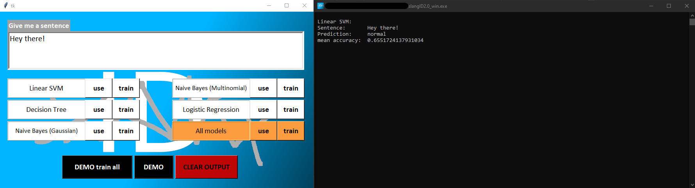

# Introducing slangID2.0

In a nutshell: The slangID project tries to detect slang phrases / sentences.

You can train Machine Learning Models with a selection of classifiers, and print out a test set of sentences with the **DEMO** button.
Or you can type a phrase and see what type it is  identified as.

# Challenges

Due to a lack of data, the results, regardless of the classifier used, are not good enough.
 Certain bigram slang words like (_a_) _**real one**_ are more difficult to resolve since the provided models do not take n-grams into consideration.
 
# How to run _slangID2.0_

Either run the **.exe** file (**Windows and Linux available**), or:

1. Install Python **3.9** or later (3.8 and 3.10 is probably fine too, I used 3.9.12).
2. Install the required packages by running **_pip install -r requirements.txt_** in your shell of choice. Make sure you are in the directory where the file is located.
3. In the project directory, open your shell (or navigate there in the shell) and run _**python slangID2.0_Windows.py** or **slangID2.0_Linux.py**_ (the difference between both versions is just the font size on some labels and buttons).

# Screenshot

# Source of the data

Most of the hand-picked sentences come from archive.org's [Twitter Stream of June 6th](https://archive.org/details/archiveteam-twitter-stream-2021-06).

Some of the sentences / phrases come from me personally, which you might recognize due to their sad and depressing nature.

# Recognition of Open Source use

* scikit-learn
* pandas
* tkinter
* PyInstaller
