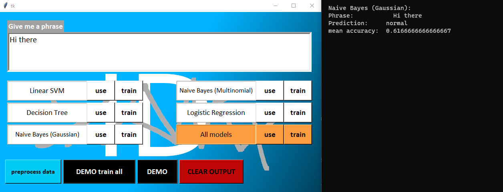

# What is slangID

In a nutshell: The slangID project tries to detect slang phrases. Something literally no one asked for...

You can train a selection of classifiers, and print out a test set of phrases with the **DEMO** button.
Or you can type a phrase and see what type it is identified as. All the models are pre-trained, but you can re-train if needed.

# Challenges

Due to a lack of data, the results, regardless of the classifier used, are not impressive right now.
 Unknown words are also an issue since the dataset is tiny. Slang phrases with normal words like 'sick' are not accounted for with a sentiment analysis either.

# Performance
In total, there are five classifiers you can choose from:

* Linear SVM (SVC with linear Kernel)
* Decision Tree
* Gaussian Naive Bayes
* Multinomial Naive Bayes
* Logistic Regression

Currently the **best performer** is the **Gaussian Naive Bayes model** with an **F1 score of ~65.70%**

# How to run slangID2

1. Install Python **3.9** or later (3.8 and 3.10 is probably fine too, I used 3.9.12).
2. Install the required packages by running `pip install -r requirements.txt` in your shell of choice. Make sure you are in the project directory.
3. And then run `python slangID2_Windows.py` or `python3 slangID2_Linux.py` (the difference between both versions is just the font size on some labels and buttons).

**Note:** It might take a while to load. Be patient.

# Screenshot

# Source of the data

Most of the phrases come from archive.org's [Twitter Stream of June 6th](https://archive.org/details/archiveteam-twitter-stream-2021-06).

# Recognition of Open Source use

* scikit-learn
* pandas
